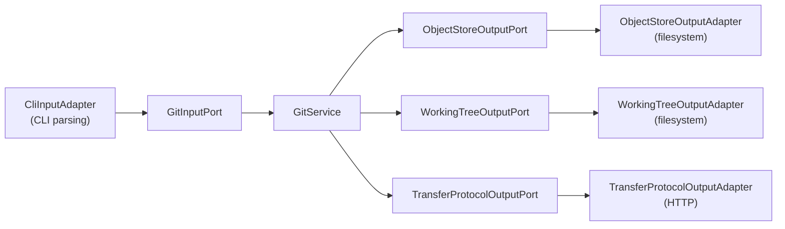

# git-effect

A Git implementation in TypeScript, built with [Effect](https://effect.website) and [Bun](https://bun.sh) following hexagonal architecture. Created as a solution to the [CodeCrafters "Build Your Own Git" challenge](https://codecrafters.io/challenges/git).

## Supported Commands

| Command | Description |
|---------|-------------|
| `init` | Initialize a new repository (creates `.git` directory structure) |
| `cat-file -p <hash>` | Pretty-print the contents of an object |
| `hash-object -w <path>` | Compute the hash of a file and optionally write it to the object store |
| `ls-tree --name-only <hash>` | List the entries of a tree object |
| `write-tree` | Write the current working directory as a tree object |
| `commit-tree <tree> -m <message> [-p <parent>]` | Create a commit object |
| `ls-remote <url>` | List references in a remote repository |
| `checkout <commit>` | Check out a commit into the working tree |
| `clone <url> [destination]` | Clone a remote repository via Git's smart HTTP protocol |

## Getting Started

### Prerequisites

- [Bun](https://bun.sh) >= 1.3.10

### Setup

```sh
bun run setup
```

This installs dependencies and clones reference repos into `.repos/` for documentation and challenge stage descriptions.

### Running

```sh
./scripts/run.sh <command> [args]
```

Or equivalently:

```sh
bun run app/main.ts <command> [args]
```

### Testing Locally

The CLI operates on the `.git` directory in the current working directory. To avoid damaging this repository's `.git`, run commands in a scratch directory:

```sh
mkdir -p /tmp/testing && cd /tmp/testing
/path/to/your/repo/scripts/run.sh init
```

Or set up an alias:

```sh
alias mygit=/path/to/your/repo/scripts/run.sh

mkdir -p /tmp/testing && cd /tmp/testing
mygit init
```

## Architecture

The project follows a **hexagonal (ports-and-adapters)** architecture. The application core defines port interfaces and domain logic with no direct dependencies on I/O. Concrete adapters are wired together at the entry point using Effect layers.



### Layers

- **Ports** (`app/ports/`) -- Interfaces defining the input and output boundaries of the application. `GitInputPort` is the driving port (called by the CLI); the three output ports are driven by the service.
- **Adapters** (`app/adapters/`) -- Concrete implementations: CLI argument parsing (`CliInputAdapter`), filesystem-backed object store and working tree, HTTP-backed transfer protocol, and a shared `RepositoryContext` that tracks the repo root.
- **Application Service** (`app/application/services/git.ts`) -- `GitService` implements `GitInputPort` by orchestrating the output ports and domain libraries. This is the only place that composes cross-cutting git operations (e.g. clone = discover refs + upload-pack + unpack + checkout).
- **Domain** (`app/domain/`) -- Pure models, encoding/decoding logic, packfile parsing, delta resolution, and error types. No I/O dependencies.

### Entry Point

`app/main.ts` composes all layers and runs the CLI:

```typescript
CliInputAdapter.pipe(
  Effect.provide(GitService),
  Effect.provide(ObjectStoreOutputAdapter),
  Effect.provide(WorkingTreeOutputAdapter),
  Effect.provide(RepositoryContextLive),
  Effect.provide(TransferProtocolOutputAdapter),
  Effect.provide(FetchHttpClient.layer),
  Effect.provide(BunServices.layer),
  BunRuntime.runMain,
);
```

## Project Structure

```
app/
├── main.ts                          # Entry point, wires layers
├── ports/
│   ├── git-input-port.ts            # Driving port (application API)
│   ├── object-store-output-port.ts  # Read/write git objects, refs, HEAD
│   ├── working-tree-output-port.ts  # Read/write working tree files
│   └── transfer-protocol-output-port.ts  # Smart HTTP transport
├── adapters/
│   ├── cli-input-adapter.ts         # CLI command/flag parsing
│   ├── object-store-output-adapter.ts  # Filesystem loose objects
│   ├── working-tree-output-adapter.ts  # Filesystem working tree
│   ├── transfer-protocol-output-adapter.ts  # HTTP upload-pack client
│   └── repository-context.ts        # Shared repo root path
├── application/
│   └── services/
│       └── git.ts                   # GitService (core use cases)
└── domain/
    ├── models/
    │   ├── object.ts                # Blob, Tree, Commit schemas
    │   ├── packfile.ts              # Pack header, entries, resolved pack
    │   └── transfer-protocol.ts     # Ref advertisement, upload-pack result
    ├── lib/
    │   ├── encode-object.ts         # Serialize git objects
    │   ├── decode-object.ts         # Deserialize git objects
    │   ├── encode-pkt-line.ts       # Encode pkt-line protocol frames
    │   ├── decode-pkt-line.ts       # Decode pkt-line protocol frames
    │   ├── parse-ref-advertisement.ts  # Parse smart HTTP ref discovery
    │   ├── build-upload-pack-request.ts  # Build upload-pack POST body
    │   ├── parse-packfile.ts        # Orchestrate packfile parsing
    │   ├── parse-pack-header.ts     # Parse pack header (version, count)
    │   ├── parse-pack-entry.ts      # Parse individual pack entries
    │   ├── parse-and-resolve-packfile.ts  # Parse + resolve deltas
    │   ├── resolve-pack-deltas.ts   # Resolve OFS/REF delta entries
    │   ├── apply-git-delta.ts       # Apply delta instructions to base
    │   ├── decode-delta-varint.ts   # Decode variable-length integers
    │   ├── parse-sideband-response.ts  # Parse sideband-64k multiplexing
    │   └── split-object-loose-path.ts  # Hash → aa/bbccdd... path split
    ├── errors/                      # Tagged error classes
    │   ├── object-decode-error.ts
    │   ├── packfile-parse-error.ts
    │   ├── pkt-line-error.ts
    │   ├── ref-advertisement-parse-error.ts
    │   ├── sideband-parse-error.ts
    │   └── upload-pack-request-error.ts
    └── utils/
        ├── compression.ts           # Zlib deflate/inflate
        ├── crypto.ts                # SHA-1 hashing
        └── concat-bytes.ts          # Uint8Array concatenation
```

## Tech Stack

| Concern | Tool |
|---------|------|
| Runtime | [Bun](https://bun.sh) |
| Language | TypeScript (strict mode) |
| Core library | [Effect](https://effect.website) (layers, services, schemas, CLI, HTTP client) |
| Linting | [oxlint](https://oxc.rs) |
| Formatting | [dprint](https://dprint.dev) |
| Type checking | `tsc` (no emit) |

## Scripts

| Script | Description |
|--------|-------------|
| `bun run setup` | Install dependencies and clone reference repos |
| `bun run dev` | Run the CLI (`bun run app/main.ts`) |
| `bun run clean` | Remove `bun.lock`, `node_modules`, `.repos`, and `.cursor` |
| `bun run typecheck` | Run the TypeScript compiler for type checking |
| `bun run format:fix` | Auto-format with dprint |
| `bun run format:check` | Check formatting without modifying files |
| `bun run lint:check` | Run oxlint and type checking |
| `bun run lint:fix` | Auto-fix lint issues with oxlint |
